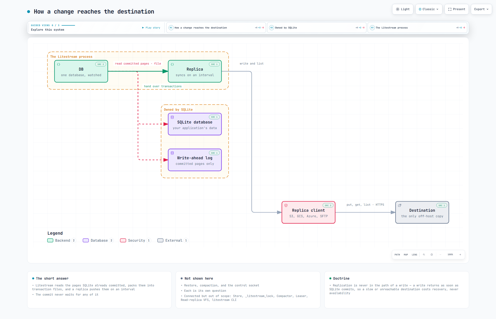
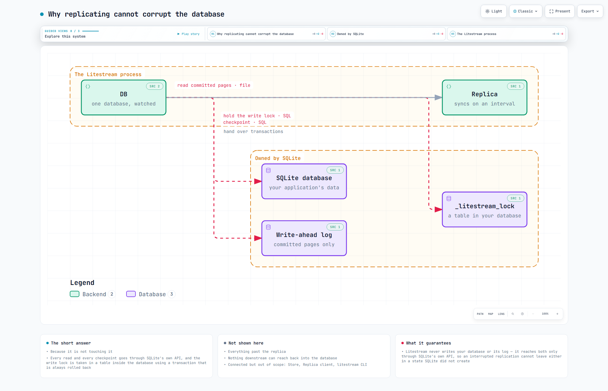

# arch-lens

**Write the architecture analysis. The diagrams compile from it.**

A Claude Code plugin, and a small Node.js tool underneath it. You — or Claude —
write one structured analysis of a system. Arch-lens compiles it into a set of
validated, interactive HTML diagrams and a markdown document that cannot disagree
with them, and never asks anyone to type a coordinate.

It does not draw. Rendering is [archify](https://github.com/tt-a1i/archify)'s job,
and archify is very good at it: deterministic HTML, a validator that refuses
overlapping labels and crossing routes, verified source links, and a real browser
check. Arch-lens supplies the thing archify has no opinion about — what the boxes
mean and why this diagram exists.

## Install

Needs Node 22+ and the archify renderer:

```
npx skills add tt-a1i/archify -g
```

Then, in Claude Code:

```
/plugin marketplace add cognitive-fab/arch-lens
/plugin install archlens@arch-lens
```

Or install it as a plain skill, which works for Claude Code, Cursor, Codex and
OpenCode alike:

```sh
git clone https://github.com/cognitive-fab/arch-lens
node arch-lens/scripts/install-skill.mjs
```

Verify with `node ~/.claude/skills/archlens/bin/archlens.mjs doctor`, which reports
where archify was found. Override the probe with `ARCHLENS_ARCHIFY` if you keep it
somewhere unusual.

## Use it from Claude Code

Open Claude Code in the project you want to understand and ask. Three shapes of
request cover most of what people want:

**Map the whole system.**

> map this architecture with archlens

Claude reads the code, writes `<name>.analysis.json`, validates it, renders one
diagram per question into `docs/architecture/`, and reports what it delivered —
including anything it had to leave out of a picture.

**Analyse a design document instead of code.**

> using docs/02-architecture.md as the only source, write an archlens analysis and render it

Naming the source keeps the analysis honest: components the document describes
but the code does not contain are marked `planned`, not `built`, and the
document is recorded in `system.sources` so a reader knows where the diagram
came from.

**Ask one question.**

> /archlens how does the harness mount the gate?

A question is the unit of a diagram. Claude finds the components the answer
turns on, writes the answer, the context and a narrative for a newcomer, and
renders a single diagram for it — an architecture, or a sequence when the
question is about an order of events. If the project already has an analysis,
the question is added to it and the new diagram joins the existing set.

**Start from what the repository already states.**

> seed an archlens analysis from docker-compose.yml, then fill it in from the code

`archlens seed` drafts the components, evidence and declared relations from a
compose file or a JavaScript workspace, and writes `TODO` where every sentence
goes. The validator warns on each TODO until it is replaced, so a draft cannot
quietly become the document.

**Review a change against it.**

> review this branch against the architecture

With an analysis in place, `archlens review --base main` maps the changed files
to the components they are evidence for and lists what the change lands on:
the boundaries it spans and what they claim, the relations whose `what_crosses`
may have moved, the guarantees attached to the diagrams that show it, and the
changed files the analysis has no component for. Claude reviews the code with
those claims in hand instead of from memory of them.

**Ask without drawing.**

> does the replica ever write to the database?

With an analysis in the project, Claude runs `archlens ask` and answers from
what comes back: the components and relations the question touches, each with
its evidence, and the facts that bear on it. When the analysis does not cover
the question it says so and names the words it never mentions, rather than
answering from memory.

Whatever you ask, the output is the same: `*.analysis.json` (the thing worth
reviewing), interactive HTML diagrams, and a markdown document generated from the
same analysis so the two cannot drift apart. Never hand-edit the generated
`*.architecture.json` or `*.html`; change the analysis and render again.

## Write the analysis yourself

Everything Claude does, you can do by hand. The analysis is a JSON file against
[`analysis.schema.json`](skills/archlens/schemas/analysis.schema.json): a
`system`, its `components`, `relations`, `boundaries`, and the `questions` each
diagram answers. Copy
[notes-app.analysis.json](skills/archlens/examples/notes-app.analysis.json) — six
components, two questions — and edit it. Then drive the CLI:

```sh
archlens validate  system.analysis.json
archlens questions system.analysis.json            # what each diagram would draw
archlens render    system.analysis.json docs/architecture --repo-root .
archlens doc       system.analysis.json ARCHITECTURE.md
archlens ask       system.analysis.json "does X ever talk to Y?"
archlens review    system.analysis.json --repo-root . --base main
archlens seed      docker-compose.yml system.analysis.json
```

`validate` checks references and warns when the analysis is too thin to be worth
drawing. `render` compiles every question, repairs each specification against
archify's diagnostics until it passes, delivers the HTML, checks it in headless
Chrome, and writes a markdown document beside the diagrams. `--repo-root` is what
turns `evidence` paths into verified source links. `ask` gathers what the analysis
says near a question, with evidence, and names what it never mentions — it
calls no model, and exits non-zero when the analysis does not cover the
question, so nothing downstream is tempted to guess. `review` reads a git
change against the analysis: which components its files are evidence for,
which boundary claims and relations to re-check, and which changed files have
no component at all. `seed` drafts an analysis from a compose file or a
workspace manifest, evidence attached, every missing sentence a `TODO`.

[GUIDE.md](skills/archlens/docs/GUIDE.md) walks through building an analysis
piece by piece and has the full field reference.

## Why the analysis comes first

A renderer holds about two words per node. Author straight into one and the
reasoning never gets written down: what ships is a picture that passes every
check and answers no question. Three diagrams of the same system, drawn from
three different readings, will disagree and nobody can say which is right.

So the analysis is the artifact:

- **Components carry a responsibility**, not a caption — one sentence saying what
  the thing is answerable for.
- **Relations carry `what_crosses`**, the data or control that actually moves.
  It is the field prose most often omits and readers most often want.
- **Boundaries carry a claim** about everything inside them. A box that only
  groups is decoration, and the validator says so.
- **Components carry a status.** `built` means it was seen in the code; `planned`
  means the design names it and the code does not. A diagram that cannot tell you
  which is which is a diagram you cannot plan from.
- **Questions are the unit of a diagram.** One diagram per question, and the
  question decides what is in it. Everything connected but out of scope is named
  on the diagram's own card rather than vanishing.
- **A question chooses its shape.** "What are the parts" is an architecture.
  "What happens when" is a sequence, drawn from the same components and relations
  with the order added — a step the model has no relation for is refused.

## The worked example

`skills/archlens/examples/litestream.analysis.json` analyses
[Litestream](https://github.com/benbjohnson/litestream), a disaster-recovery
sidecar for SQLite, at commit `4ed7a30`. Thirteen components, two boundaries, five
questions — four architectures and one sequence:

| Question | Asks |
|---|---|
| How a change reaches the destination | What happens between a committed transaction and an object in storage? |
| One second in the life of a replica *(sequence)* | What happens, in order, between one monitor tick and the next? |
| Why replicating cannot corrupt the database | A background process is touching a live database. Why is that safe? |
| How a database is rebuilt | The machine is gone. What does it take to get the database back? |
| Keeping it running and keeping it small | What stops the history growing forever, or two processes fighting over one bucket? |

Litestream was chosen because its architecture is mostly an argument about what
crosses a boundary, which is the part a diagram usually loses. Two of the four,
as rendered:



The first question. The commit never waits: every edge that touches SQLite's
files is a read, and the only writes go to the off-host destination.

That is what the diagram can hold. Below it — on the HTML page and in the
generated markdown — comes the prose the same analysis carries for this
question: a `context` that says why the question matters, a `narrative` that
walks the picture for a newcomer, and the `glossary` terms the question actually
uses. From the generated document, lightly trimmed:

> **What happens between a committed transaction and an object in storage?**
>
> Most backup tools copy a file on a schedule, which means a crash loses
> everything since the last copy. Litestream promises something closer to
> continuous: every committed transaction reaches object storage within about a
> second. The tension is that SQLite is a library inside your process, not a
> server Litestream can subscribe to, so it has to find out about changes from
> the outside without slowing the application down.
>
> #### The long read
>
> Start at the bottom left, with the two files that belong to SQLite. Your
> application writes to the SQLite database through SQLite's normal API. In
> write-ahead-log mode, SQLite does not change the database file on each commit;
> it appends the changed pages to a separate write-ahead log and only later
> folds them back into the main file in a step called a checkpoint. That log is
> the only thing Litestream watches.
>
> DB is Litestream's view of one database. Once a second it looks at the log,
> and when it sees frames past the last position it recorded, it reads them.
> These are pages SQLite has already committed, so DB is never reading a
> half-finished transaction. It packs the frames for a range of transactions
> into a transaction file — an LTX file — and hands it to the Replica. […]
>
> The thing to hold on to is what is not on the diagram: a path from the commit
> to the destination. Your application's commit returns as soon as SQLite has
> written the log. Everything Litestream does happens afterwards, on its own
> clock. If the destination is slow or unreachable, transaction files queue
> locally and the application does not notice. That is a deliberate trade — the
> last second of writes can be lost — in exchange for replication that cannot
> make your application wait.
>
> #### Terms used here
>
> - **write-ahead log** — A file SQLite appends committed pages to instead of
>   changing the database file immediately. Readers see a consistent database;
>   the changes are folded into the main file later by a checkpoint.
> - **checkpoint** — The step in which SQLite copies pages from the write-ahead
>   log back into the database file and can then truncate the log. Litestream
>   asks for checkpoints through SQLite's API; it never does the copying itself.
> - **transaction file** — Litestream's unit of replication: the committed pages
>   for a contiguous range of transactions, encoded in its own format. Level 0
>   holds one per sync; compaction merges them into larger ones.

The glossary is written once, at the top level of the analysis; each question
shows only the terms found in its own prose and components, so the twelve-term
Litestream glossary costs this diagram five lines.


The same six components, asked a different question: not *which parts touch*
but *in what order*. The analysis declares `shape: "sequence"` and eight
`steps`, each along a relation the architecture already has — the validator
refuses a step it cannot find an edge for. The three phases are the two loops
and the rarer checkpoint between them, which the architecture diagram above
cannot show at all.



The second. Same components, narrower question, so the destination side drops
off and `_litestream_lock` appears — the guarantee is on the card, not left to
the reader to infer from arrows, and its narrative is where the rolled-back lock
transaction and the PASSIVE-versus-TRUNCATE checkpoint modes get explained.
Every diagram is an interactive HTML page with source links, guided views and a
dark theme; these are its automated browser-check screenshots, which capture the
top of the page. To reproduce them, clone Litestream anywhere and point the
renderer at it:

```sh
git clone https://github.com/benbjohnson/litestream /tmp/litestream
archlens render skills/archlens/examples/litestream.analysis.json /tmp/out \
  --repo-root /tmp/litestream
```

All five diagrams pass nine artifact checks with zero errors and contain at
four viewports in light and dark; the four architectures carry source links
verified against git. The render writes the screenshots above beside each HTML
file, as `*.visual-check.<viewport>.<theme>.png`.

## What it does for you

**Layout.** Columns come from the relation graph, rows from the boundaries. Each
boundary gets a horizontal band of its own, because archify draws a boundary as
the bounding box of its members: two boundaries whose members interleave produce
two overlapping boxes, and an overlapping box asserts a containment nobody wrote.
Relations are never left inside one column, and an edge that skips a column gets
its own routing lane with a staggered exit port.

**Proportion.** archify fits a diagram to the available width and lets the height
follow, so a tall narrow picture is stretched rather than spared and runs off the
bottom of the screen. Arch-lens trades height for width until the projection fits,
then picks the column gap at which node text still clears the readable floor —
before writing any of that text.

**Repair.** archify's diagnostics are unusually good — a label collision arrives
with the exact `labelAt` that resolves it — so a loop reads them and edits:
re-place labels, route around an obstructing node, give a shared corridor its own
lane, narrow the diagram, shorten a detail on a word boundary. It stops when the
error count stops reaching a new minimum, and reports whatever it could not fix.

**Honesty.** Everything lost between the analysis and the picture is reported as a
`dropped` line: components out of scope, a boundary drawn around only some of its
members, a detail shortened. Source links are emitted only when there is a
repository revision to verify them against.

## Documentation

- **[GUIDE.md](skills/archlens/docs/GUIDE.md)** — the walkthrough: build an
  analysis piece by piece, run it, read the output, and a full field reference.
- **[notes-app.analysis.json](skills/archlens/examples/notes-app.analysis.json)** —
  a small invented example, six components and two questions, to copy from.
- **[litestream.analysis.json](skills/archlens/examples/litestream.analysis.json)** —
  a real one: [Litestream](https://github.com/benbjohnson/litestream) analysed at
  a pinned commit, with source links verified against git.
- **[analysis.schema.json](skills/archlens/schemas/analysis.schema.json)** — every
  field, with the reasoning in its descriptions.
- **[SKILL.md](skills/archlens/SKILL.md)** — what Claude reads.

## Layout of this repository

```
.claude-plugin/                marketplace and plugin manifests
skills/archlens/               the plugin's skill, self-contained
  SKILL.md                     how Claude is meant to use all of it
  bin/archlens.mjs             the CLI
  src/model.mjs                referential validation and the thin-analysis warnings
  src/layout.mjs               ranks, bands, lanes, ports, and the text budget
  src/compile.mjs              one question -> one archify specification
  src/sequence.mjs             the same, for a question with an order to it
  src/ask.mjs                  what the analysis says near a question, and what it never mentions
  src/review.mjs               a change, read against the analysis
  src/git.mjs                  the change, as git tells it
  src/seed.mjs                 a draft analysis from a compose file or a workspace
  src/yaml.mjs                 enough YAML to read a compose file
  src/repair.mjs               the diagnostic-driven repair loop
  src/markdown.mjs             the same analysis, as prose
  src/archify.mjs              where archify is, and how to run it
  schemas/analysis.schema.json the model
  docs/GUIDE.md                the walkthrough and field reference
  examples/                    one invented, one real
scripts/install-skill.mjs      installs the skill folder into each agent
test/                          the tests, over what can be wrong quietly
```

## Status

v0.1, and honest about it. The marketplace manifest validates with
`claude plugin validate`, and the published plugin has been installed from
GitHub and used to render the Litestream example from its own install path. Run end to end on two systems. The repair loop handles
six classes of renderer diagnostic and reports anything else rather than guessing.
`archify` is MIT, and this is a consumer of it, not a fork.

MIT licensed.
